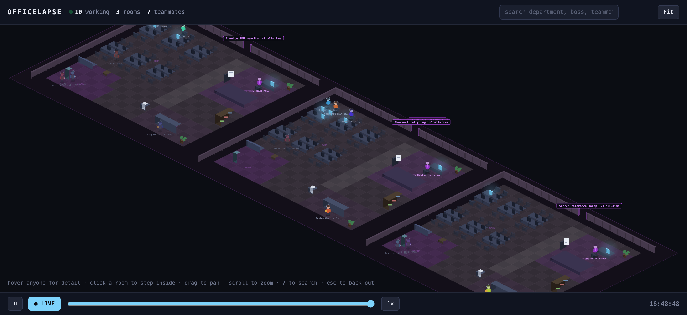
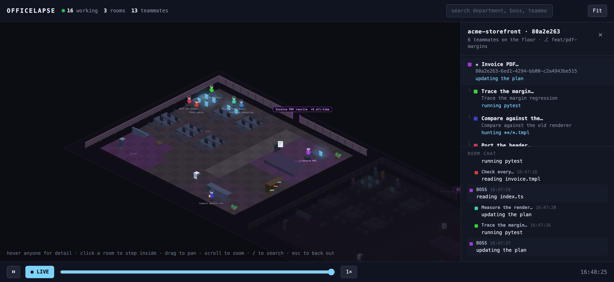

# officelapse

Your Claude Code sessions, as an isometric office you can walk through — and rewind.



Every Claude Code session on your machine becomes a **team room**. The session itself is the
boss at the head desk; every subagent it spawns is a **teammate** with their own desk, their
own job title, and their own chair. Tool calls drive what they do — they type at their desk,
walk to the filing cabinet to grep, report to the boss, take a break at the cooler, and walk
out when the session goes quiet.

It reads your existing session logs. There is nothing to install into Claude Code.

---

## Why another agent office

There are several pixel-office visualisers for Claude Code. Three things make this one different:

**1. Nothing to install into Claude Code.** No hooks, no wrapper command, no websocket, no
config. It reads `~/.claude/projects` directly, read-only. Point it at your machine and it
works — including on sessions that finished days ago.

**2. Replay, not just live.** Scrub back through the window and watch the whole day play out
at up to 1800×. Live visualisers show you the present; this shows you what your agents
actually did while you were away.

**3. The real subagent tree.** Subagents don't live in the session file — they each get their
own `subagents/agent-<id>.jsonl`, and the parent link is the directory name. A session that
spawned 18 agents renders as 18 distinct people, each with their own desk and their own task,
not one anonymous "helper". On a busy day that is ~85% of all tool calls, which a
session-file-only reader throws away.

---

## Run it

```bash
git clone https://github.com/deepak982/officelapse.git
cd officelapse
./run.sh
```

Python 3 standard library only — no dependencies, no build step. It opens
<http://localhost:8777>.

```bash
PORT=9000 HOURS=72 ./run.sh     # different port, wider time window
```

`PORT` defaults to `8777`, `HOURS` to `24`. Logs go to `/tmp/officelapse.log`. Running it
again kills the previous instance and rebinds, so it doubles as a restart.

It finds your session logs on its own, in this order:

1. `OFFICELAPSE_ROOT`, if you set it
2. `$CLAUDE_CONFIG_DIR/projects`, if Claude Code's config dir has been relocated
3. `~/.claude/projects`

No configuration needed on a normal install — every project and session on the machine is
discovered automatically, and new ones appear as new rooms while it runs (it re-reads every
two seconds). A machine that has never run Claude Code simply shows an empty floor.

**Platforms.** macOS and Linux. On Windows use WSL or Git Bash, or run `python3 server.py`
directly and open the URL yourself — `run.sh` is only a convenience wrapper.

**Claude Code versions.** The reader is built against the session-log layout of Claude Code
2.1.x (`<sessionId>.jsonl` plus `<sessionId>/subagents/agent-<id>.jsonl`). Older versions that
predate the `subagents/` directory will still render bosses, just without teammates.

---

## Controls



| | |
|---|---|
| **Hover anyone** | full detail — task, agent id, who they report to, branch, model, desk, last active |
| **Click a room** | step inside; the side panel shows the boss → teammate tree and that room's chat |
| **Drag / scroll** | pan and zoom · **Fit** resets the view and clears the search |
| **`/`** | search — matches department, session, branch, teammate and task text; Enter jumps to the first hit |
| **Esc** | back out of a room |
| **Click a bubble** | pin it so it stays up |
| **LIVE** | follow the present · **⏸** pause · **1×…1800×** replay speed · **scrubber** jump anywhere in the window |

Above 10× it switches to fast-forward: walks and bubbles are skipped, since nobody can walk
thirty simulated minutes in one real second. The room chat keeps recording every line.

---

## How the data maps

```
~/.claude/projects/<proj>/<sessionId>.jsonl                        → a boss, in their own room
~/.claude/projects/<proj>/<sessionId>/subagents/agent-<id>.jsonl   → one teammate each
```

| In the logs | On the floor |
|---|---|
| project (working directory) | a **department** — its own carpet colour and sign |
| session | a **team room** |
| the session's `aiTitle` | the room's name, e.g. *MR 2908 review* |
| subagent | a **teammate**; their first brief becomes their job title |
| `Read` / `Edit` / `Write` / `Bash` | typing at their desk |
| `Grep` / `Glob` | a trip to the filing cabinet |
| `Task` / `Agent` / `SendMessage` | walking over to the boss desk |
| `WebFetch` / `WebSearch` | thinking, over by the cooler |
| quiet for 90s | wanders off for a break |
| quiet for 15 min | clocks out and leaves through the door |

---

## How it works

Four files, no framework, no build:

| File | Role |
|---|---|
| `server.py` | reads the jsonl incrementally by byte offset, serves `GET /api/state?since=<epoch>`. Python stdlib only |
| `floor.js` | the building — departments, rooms, zones, desk claims, the walkability grid and BFS pathfinding. Pure, no DOM, runs under node for its tests |
| `office.js` | the isometric renderer, the people, and their behaviour |
| `chat.js` | speech bubbles (real DOM, so they can be hovered and pinned) and the per-room chat log |

Three details that matter if you read the code:

- **Rooms never move.** A room takes a permanent slot on first sight and keeps it. Re-packing
  the floor whenever a team grows is what makes everyone teleport.
- **Desk claims are permanent** for the life of the session, so scrubbing the timeline always
  puts the same teammate back at the same desk.
- **Paths are verified, not sampled.** `lineClear()` cuts each segment at every grid line it
  crosses and tests the tile on each interval, plus both shoulders at corner crossings. Stride
  sampling misses slices thinner than the stride, and smoothing tries the longest legs first —
  exactly where those slivers occur.

---

## Tests

```bash
node test_floor.js       # floor plan + pathfinding
node test_runtime.js     # desk overflow, recycling, queueing, room stability
python3 test_reader.py   # log reading: huge files, partial writes, odd sessions
python3 test_labels.py   # tool call → what a worker says
python3 test_tree.py     # boss → teammate tree, against your real logs
```

`test_floor.js` pins the invariants the floor exists for: no room overlaps, rooms never move
when a team grows, every desk and station reachable from the door, no path enters a blocked
tile or cuts a blocked corner, desk claims stable across regrowth, queue spots never
double-booked.

**[EDGE_CASES.md](EDGE_CASES.md)** is the checklist these suites exist to cover — what happens
when the logs are not tidy. Every entry was checked against real logs on a live machine or is
pinned by a test, and the ones that are *not* handled are listed as plainly as the ones that
are. Some highlights of what real data turned up:

- session log files of **576MB** (read from the tail, not slurped)
- **118 agent ids reused across different sessions** (so people are keyed by session + agent)
- sessions with **135 subagents** against 24 desks (overflow hot-desks; desks recycle on
  clock-out)
- timestamps predating 2020, partial final lines, and 173k events sharing a single second

---

## Privacy

It reads `~/.claude/projects` and never writes there. The server binds to `127.0.0.1` only.
Nothing is uploaded and there is no telemetry — everything stays on your machine.

Session logs contain your prompts, file paths and shell commands, and this page displays them.
Worth remembering before you screen-share it.

---

## Requirements

Python 3.8+ and a modern browser. Node is only needed for `test_floor.js`.

## Licence

MIT
